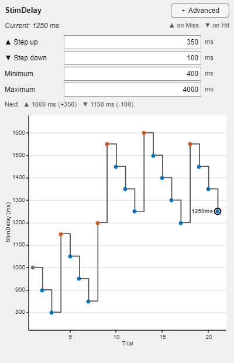
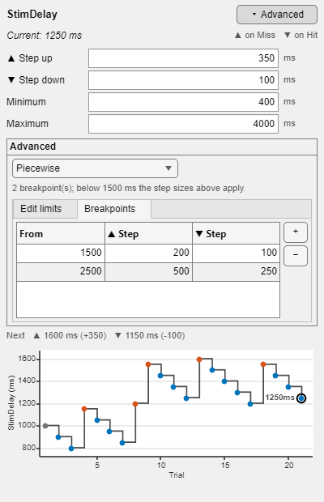

# AdaptiveTraining



`gui.AdaptiveTraining` configures the step rule that drives a single `hw.Parameter` during progressive training, and plots where that rule has taken it.

It is designed to be embedded inside another UI (panel/grid/etc.) or used standalone in its own figure. `gui.eval_adaptive_training_mode` is what normally opens it.

## What problem it solves

In many training tasks you adjust a parameter over time based on trial outcomes:

- If the subject is doing well, make the task *harder*.
- If the subject is struggling, make the task *easier*.

This class provides:

- Fields for `StepUp`, `StepDown`, `MinValue`, `MaxValue`.
- A choice of **value space** the steps are taken in (linear, proportional, power-law, piecewise) under **Advanced**.
- A preview line naming the two values the next step would land on.
- `updateParameter("up"|"down")` to apply a step to `Parameter.Value`.
- A plot of the value history, coloured by step direction.

## The window

Top to bottom:

| Region | What it is |
|---|---|
| Header | Parameter name, its current value, and which outcome steps which way |
| Step fields | `Step up`, `Step down`, `Minimum`, `Maximum`, each with the parameter's unit |
| **Advanced** | The value space, and the per-field edit limits — collapsed by default |
| Preview | `Next ▲ 1600 ms (+350)  ▼ 1150 ms (−100)` |
| Plot | The value history as a stair trace |
| Status | Why an edit was rejected |

The **≥ / ≤ edit limits** live under Advanced. They bound what may be typed into the four fields, are set once per rig if ever, and previously occupied two of the four columns of the settings table — where an operator read past them every time they wanted to change a step size. Each field's accepted range is still one hover away, in its tooltip.

The disclosure state is remembered per rig (preference group `AdaptiveTraining`, key `ShowAdvanced`). When the window owns its figure it grows to make room for the section rather than taking the space from the plot.

## Value spaces



An adaptive track does not have to walk in equal native-unit steps. `ScaleType` decides how the step size changes as the value moves:

| `ScaleType` | Rule | Use it when |
|---|---|---|
| `"linear"` (default) | `v ± Step` | The parameter is already perceptually linear |
| `"logarithmic"` | `v * exp(±Step/Ref)` | Equal *ratios* matter — a delay, a frequency, an interval |
| `"power"` | `((v^p) ± Step·p·Ref^(p−1))^(1/p)` | A compressive (`p<1`) or expansive (`p>1`) perceptual scale |
| `"piecewise"` | Linear, with the magnitudes from the breakpoint table | Coarse steps far from threshold, fine steps near it |

### The magnitudes keep one meaning

`StepUp` and `StepDown` always mean **this many parameter units at the reference value**. Every space is calibrated so that its slope at the reference matches a linear step of the same size; away from the reference the spacing warps.

That is deliberate. Switching space must not silently rescale a ladder that already works — it should only change how that ladder spreads out. A rig running 100 ms steps around 400 ms still takes a ~100 ms step at 400 ms after switching to proportional; what changes is that the step is ~200 ms at 800 ms and ~50 ms at 200 ms.

The **reference** is shown in the Advanced row and is editable. Left unset (`NaN`) it resolves to the first usable value among `MinValue`, `MaxValue`, the parameter's current value, and 1 — and the field is seeded with the resolved number as soon as a warped space is chosen, so it is never a hidden quantity. It has to be a *fixed* value: calibrating on the current value would make every step the same fraction of wherever the track happens to be, which is a linear step with extra arithmetic.

### Proportional stepping needs positive values

`"logarithmic"` is undefined at and below zero. A step from a non-positive value is **refused**: the parameter is left alone, the preview line and the status line say why, and the refusal is logged once rather than once per trial. Keep `MinValue` above zero when using it.

### Piecewise breakpoints

The Breakpoints tab holds `[From value, ▲ Step, ▼ Step]` rows. The active row is the last one whose *From* value is at or below the current value; below the first breakpoint the `Step up`/`Step down` fields apply. Rows are sorted by *From* on entry, so they can be typed in any order, and a row with a non-finite *From* is dropped (it could never be selected).

### From code

Every rule is a public property, so a paradigm can configure one without the operator touching Advanced:

```matlab
G = gui.AdaptiveTraining(p, ...
    MinValue=400, MaxValue=4000, StepUp=100, StepDown=50, ...
    ScaleType="logarithmic", ScaleReference=400);

G.ScaleType = "piecewise";
G.Breakpoints = [1500 200 100; 2500 500 250];
```

`gui.eval_adaptive_training_mode` forwards `ScaleType`, `ScaleExponent`, `ScaleReference` and `Breakpoints` to the constructor.

Setting any of them from a script refreshes the window; the operator can still change them afterwards. None of the rule settings are persisted between sessions — only the disclosure state and the window position are. A remembered training *regime* would change how a subject is trained without anyone choosing it that session.

### Headless

The step rule is a pure static, so it can be exercised — or reused — without a figure:

```matlab
[v, info] = gui.AdaptiveTraining.stepValue(1000, "up", ...
    StepUp=100, ScaleType="logarithmic", ScaleReference=400, MaxValue=4000);
```

`info` reports `Ok`, `Message`, `Direction`, `Step`, `Unclamped`, `Clamped` and `Delta`. It never throws: its caller is a trial-completion listener.

## Immediate commit and reject-on-violation

Edits apply immediately — editing `Step up` writes `obj.StepUp`, editing a limit cell writes `obj.StepUpLimits(1)`. The GUI does **not** change `Parameter.Value` when you edit these; that happens only in `updateParameter`.

An edit that would violate a constraint is rejected: the widget reverts to the committed value and the status line says why.

- `MinValue` must be ≤ `MaxValue`.
- Every value must stay within its own limits.
- Step sizes must be finite and > 0; step limits must be ≥ 0 with an upper limit > 0.
- Breakpoint steps must be finite and > 0.

Assigning `StepUp`, `StepDown`, `MinValue`, `MaxValue`, or one of the four `*Limits` properties from a script redraws the window the same way, but is **not** re-validated: a script is trusted the way the constructor's options are, and these rules belong to the operator's edits. A widget edit assigns up to two of these properties and then refreshes once; the per-property redraw stands down for its duration, since every refresh reads `Parameter.Value` and on a hardware backend that is a device round trip.

## The plot

- A **stair** trace, because that is what the data is: the parameter holds each value until the next outcome moves it, and interpolating between steps would draw a ramp the rig never played.
- Markers coloured by direction — up, down, and the value the session started from.
- The newest value is circled and labelled.
- `MinValue`/`MaxValue` are drawn as dashed reference lines, but only when the track is close enough for them to matter. The axis is scaled to the **trace**: a ladder working between 800 and 1600 ms inside bounds of 400 and 4000 ms would otherwise be squeezed into a quarter of the axes, and its fine structure is the point.
- Under `"logarithmic"` the y axis is a log axis, so the spacing that was configured is the spacing that is seen.
- Every graphics object is created once and updated in place — a training session is hundreds of trials, and one object per step would leave hundreds of them to re-render on every `drawnow`.

Right-click the plot or the settings for **Advanced settings**, **Reset history**, and **Copy history to clipboard**.

## Constructor

```matlab
G = gui.AdaptiveTraining(Parameter)
G = gui.AdaptiveTraining(Parameter, Name=Value, ...)
```

Name–value options:

- `Parent` (default `[]`): if provided, the GUI is embedded in this container.
- `MinValue`, `MaxValue`, `StepUp`, `StepDown`: initial committed values.
- `StepUpLimits`, `StepDownLimits`, `MinValueLimits`, `MaxValueLimits`: initial edit limits.
- `ScaleType`, `ScaleExponent`, `ScaleReference`, `Breakpoints`: the value space.
- `ShowAdvanced`: open the Advanced section. Unstated, the operator's remembered preference decides.
- `StepUpResponse`, `StepDownResponse`: shown in the header; the listener in `gui.eval_adaptive_training_mode` is what acts on them.
- `WindowStyle`: `"alwaysontop" | "modal" | "normal"` (only used when `Parent=[]`).

## updateParameter

```matlab
v = G.updateParameter("up")
v = G.updateParameter("down")
```

- Input is case-insensitive; anything else is a no-op.
- Returns the new parameter value, clamped to `[MinValue, MaxValue]`.
- Appends to `G.ValueHistory` and `G.StepDirections`, and refreshes the readout, the preview and the plot.

`updateParameter` writes `Parameter.Value` directly. If another part of your application also updates the same parameter, synchronisation is your responsibility. (`gui.eval_adaptive_training_mode` suspends `isRandom` for exactly this reason, and `cl_AppetitiveStimDetect` stands its block sequence down.)

`resetHistory()` discards the plotted history and restarts it from the current value.

## Requirements and dependencies

`hw.Parameter` — the class reads `Name`, `Value`, `ValueStr`, `Unit` and `Format`. The unit and format are display only; they are what put `ms` beside the fields and on the axis.

## Lifecycle and cleanup

- With no `Parent`, the class creates and owns a `uifigure` and remembers its position (preference group `AdaptiveTraining`, key `Position`).
- Embedded, it attaches a listener and deletes itself when the parent is destroyed.
- Deleting the object deletes the UI it owns.

## Notes and limitations

- The value history starts with `Parameter.Value` as it was when the GUI was constructed.
- This class validates its own `MinValue`/`MaxValue`; it does not enforce `hw.Parameter.Min`/`Max` (`hw.Parameter` clamps on write itself).

## Related files

- `obj/+gui/@AdaptiveTraining/` (this class; `stepValue.m` is the rule)
- `obj/+gui/eval_adaptive_training_mode.m` ([doc](eval_adaptive_training_mode.md))
- `obj/+hw/@Parameter/Parameter.m`
- `tmp/smoke_test_adaptive_training.m` (standing proof)
