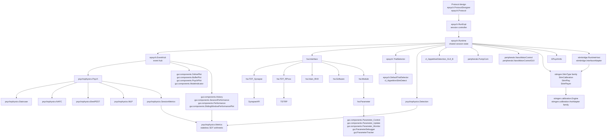

# EPsych Class Map

This document complements the architecture overview with two class-oriented views of the toolbox:

- a strict inheritance map for the major classes
- a runtime dependency map showing how the major classes interact during a running session

The emphasis is on the classes developers are most likely to touch when changing experiment startup, runtime behavior, hardware integration, online analysis, or live GUIs.

**This map is the shape; the [Class Reference](https://github.com/dstolz/epsych2/wiki/Class-Reference) is the directory.** The wiki index carries one page per class — a class diagram, the properties and methods, and what each default means — grouped by topic and alphabetical within a group. Use the maps below when you do not know where a class sits, and the class page when you know which class you need.

## Inheritance map

This view shows inheritance only. To keep the tree readable, detailed MATLAB base types are moved into the summary tables below.

### Core runtime and hardware

```text
EPsych major classes
├─ epsych
│  ├─ Protocol
│  ├─ ProtocolDesigner
│  ├─ RunExpt
│  ├─ Runtime
│  ├─ EventHub
│  ├─ TrialSelector
│  │  └─ DefaultTrialSelector
│  ├─ BlockSequence
│  ├─ Subject
│  │  └─ DefaultSubject
│  ├─ BitMask
│  ├─ TrialJournal
│  ├─ ReviewSession
│  ├─ SessionSnapshot
│  ├─ eventModeChange
│  └─ TrialsData
├─ hw
│  ├─ Interface
│  │  ├─ TDT_Synapse
│  │  ├─ TDT_RPcox
│  │  ├─ Intan_RHX
│  │  ├─ VlcRecorder
│  │  ├─ Replay
│  │  └─ Software
│  ├─ Module
│  ├─ Parameter
│  ├─ DeviceState
│  ├─ InterfaceSpec
│  └─ InterfaceSpecOption
└─ top-level
   └─ PRGMSTATE
```

### Analysis, stimuli, and GUI

```text
Analysis and GUI classes
├─ psychophysics
│  ├─ Psych
│  │  ├─ Staircase
│  │  ├─ NAFC
│  │  ├─ BestPEST
│  │  ├─ MLP
│  │  └─ SessionMetrics
│  ├─ Detect
│  ├─ Detection
│  ├─ Metrics                   (static only; stateless SDT arithmetic)
│  └─ TrialWindow               (value class)
├─ stimgen                      (submodule; concrete stimuli vary by pinned commit)
│  ├─ StimType
│  │  └─ ...                    see obj/stimgen/documentation/stimgen_StimTypes.md
│  ├─ HardwareHost              ← implemented by stimbridge.RuntimeHost
│  ├─ StimCalibration
│  ├─ StimPlay
│  ├─ StimPlayer
│  ├─ StimInspector
│  └─ calibration
│     ├─ HwAdapter              ← implemented by stimbridge.InterfaceAdapter
│     │  └─ WindowsSoundCardAdapter
│     ├─ Engine
│     └─ CalibrationGui
├─ stimbridge
│  ├─ RuntimeHost
│  └─ InterfaceAdapter
└─ gui
   ├─ BasicGUI
   ├─ BehaviorBuilder
   ├─ ComponentToolbar
   ├─ Helper
   │  └─ Triggers
   ├─ Parameter_Control
   ├─ Parameter_Monitor
   ├─ Parameter_Update
   ├─ ParameterDebugger
   ├─ ParameterTracker
   ├─ ElapsedTrialTimer
   ├─ GenericTimer
   ├─ MicrophonePlot
   ├─ FilenameValidator
   ├─ ModeIndicator
   ├─ BufferPlot
   ├─ History
   ├─ KeyBindings
   ├─ OnlinePlot
   ├─ Performance
   ├─ PhaseSelector
   ├─ PsychPlot
   ├─ RegenerateTrial
   ├─ ScreenCapture
   ├─ SlidingWindowPerformancePlot
   ├─ StaircaseTraining
   └─ StatusBar
```

### Support branches

```text
Support and task-specific classes
├─ peripherals
│  ├─ PumpCom
│  ├─ NanoMotorControl
│  └─ NanoMotorControlGUI
├─ util
│  └─ VideoConverter → gui.VideoConverterSetup
├─ granary                        (git submodule at obj/granary: dstolz/granary)
│  ├─ Logger
│  ├─ Level (int32 enumeration)
│  └─ sink.Sink
│     ├─ sink.Console
│     └─ sink.FileSink
│        ├─ sink.TextFile
│        └─ sink.JsonLines
├─ helpers
│  ├─ EPsychInfo
├─ cl
│  ├─ cl_AppetitiveDetection_GUI_B
│  └─ cl_AppetitiveStimDetect
└─ runtime/guis
   └─ ep_GenericGUI
```

### Key base classes

| Area | Root class | Base type | Role |
| --- | --- | --- | --- |
| epsych | `RunExpt` | `handle` | Main session controller GUI |
| epsych | `Runtime` | `handle & dynamicprops` | Shared runtime state container |
| epsych | `TrialSelector` | `handle` | Abstract pluggable trial-selection API |
| hw | `Interface` | `matlab.mixin.Heterogeneous & matlab.mixin.SetGet` | Abstract hardware API |
| hw | `Module` | `handle` | Container for grouped parameters |
| hw | `Parameter` | `matlab.mixin.SetGet` | Runtime parameter wrapper |
| psychophysics | `Psych` | `handle & matlab.mixin.SetGet` | Abstract analysis base |
| psychophysics | `Metrics` | *(static only)* | Stateless signal-detection arithmetic every analysis calls |
| stimgen | `StimType` | `handle & matlab.mixin.Heterogeneous & matlab.mixin.Copyable & matlab.mixin.SetGet` | Abstract stimulus base |
| stimgen | `HardwareHost` | `handle` | Abstract contract a host implements to give stimgen GUIs hardware access |
| stimgen | `calibration.HwAdapter` | `handle` | Abstract play/record contract for the calibration engine |
| gui | `Helper` | `handle` | Shared GUI helper base |
| granary | `sink.Sink` | `handle` | Abstract log destination behind `vprintf` |

> 🔑 **Four abstract classes are the toolbox's extension points.** `hw.Interface` (a backend), `epsych.TrialSelector` (trial selection), `psychophysics.Psych` (analysis), and `stimgen.StimType` (a stimulus, in the submodule). Almost every extension is a subclass of one of them.

`psychophysics.Metrics` is the one row above that is not a base class. It is listed here because it is shared infrastructure rather than a component: it holds the signal-detection formulas — d', criterion, A', B'', the corrections for rates of 0 and 1 — that `SessionMetrics`, `Detection`, the performance plots and `teensy.Simulator` all call rather than reimplement. See [psychophysics_Metrics.md](../psychophysics/psychophysics_Metrics.md).

The `stimgen` package is a git submodule (see [../stimgen.md](../stimgen.md)) and
has no dependency on EPsych. EPsych implements its two abstract classes in
`obj/+stimbridge/`: `stimbridge.RuntimeHost` (a `stimgen.HardwareHost`) and
`stimbridge.InterfaceAdapter` (a `stimgen.calibration.HwAdapter`).

## Runtime dependency map

> ⚠️ **This second map is not inheritance.** It shows which objects *hold and call* which during a session. Reading a dependency arrow as a subclass relationship is the usual way to misread it.

This view is not inheritance. It shows the main runtime relationships during a typical session. The Mermaid diagram gives the fast overview, and the short tree below keeps the same information in plain text.



### Layered runtime view

```text
Protocol authoring
├─ epsych.ProtocolDesigner
└─ epsych.Protocol
   ↓
Session control
└─ epsych.RunExpt
   ↓
Runtime state and events
├─ epsych.Runtime
└─ epsych.EventHub
   ↓
Hardware layer
├─ hw.Interface
│  ├─ hw.TDT_Synapse → SynapseAPI
│  ├─ hw.TDT_RPcox → TDTRP
│  ├─ hw.Intan_RHX
│  ├─ hw.VlcRecorder
│  └─ hw.Software
└─ hw.Module → hw.Parameter
   ↓
Trial selection
├─ epsych.TrialSelector
└─ epsych.DefaultTrialSelector / cl_AppetitiveStimDetect
   ↓
Analysis and visualization
├─ psychophysics.Psych → psychophysics.Staircase / psychophysics.NAFC / psychophysics.BestPEST / psychophysics.MLP / psychophysics.SessionMetrics
├─ psychophysics.Detection
├─ psychophysics.Metrics  (stateless SDT arithmetic; called by all of the above)
├─ gui.components.Parameter_Control / gui.components.Parameter_Update / gui.components.Parameter_Monitor / gui.ParameterDebugger / gui.ParameterTracker
├─ gui.components.OnlinePlot / gui.components.BufferPlot / gui.components.PsychPlot / gui.components.ModeIndicator
└─ gui.components.History / gui.components.SessionPerformance / gui.components.Performance / gui.components.SlidingWindowPerformancePlot
   ↓
Task and support branches
├─ cl_AppetitiveDetection_GUI_B
├─ peripherals.PumpCom
├─ peripherals.NanoMotorControl / peripherals.NanoMotorControlGUI
├─ stimbridge.RuntimeHost / stimbridge.InterfaceAdapter  (seam into the submodule)
├─ stimgen.StimType family / StimCalibration / StimPlay / StimPlayer
└─ stimgen.calibration.Engine / HwAdapter family
```

### Main dependency patterns

| Pattern | Typical direction |
| --- | --- |
| Session lifecycle | `epsych.RunExpt -> epsych.Runtime` |
| Hardware control | `epsych.Runtime -> hw.Interface -> hw.Module -> hw.Parameter` |
| Backend bridge | `hw.TDT_Synapse -> SynapseAPI`, `hw.TDT_RPcox -> TDTRP` |
| Trial selection | `ep_TimerFcn_Start -> epsych.TrialSelector.create(...) -> selector subclass` |
| Online analysis | `epsych.EventHub events -> psychophysics.Psych subclasses` |
| Parameter GUIs | `gui.Parameter_* <-> hw.Parameter` |
| Task GUIs | `cl.* -> epsych.Runtime -> psychophysics.* + gui.*` |

## Practical reading order

If you are tracing a live experiment session, the fastest route through the code is usually:

1. `epsych.RunExpt`
2. `epsych.Runtime`
3. `hw.Interface` and the active backend subclass
4. `hw.Module` and `hw.Parameter`
5. task GUI classes and psychophysics analysis classes attached to the runtime

If you are tracing online plots or task summaries, start with the task GUI class and then follow its references into `psychophysics.*`, `gui.*`, and the `Runtime.EVENTS` event path.

## Related documentation

- Per-class reference pages: [Class Reference](https://github.com/dstolz/epsych2/wiki/Class-Reference) (wiki) — one page per class, with its class diagram and members
- Architecture overview: [Architecture_Overview.md](Architecture_Overview.md)
- Runtime details: [../epsych/epsych_Runtime.md](../epsych/epsych_Runtime.md)
- Hardware interfaces: [../hw/hw_Interface.md](../hw/hw_Interface.md)
- Hardware modules: [../hw/hw_Module.md](../hw/hw_Module.md)
- Hardware parameters: [../hw/hw_Parameter.md](../hw/hw_Parameter.md)
- Psychophysics base class: [../psychophysics/psychophysics_Psych.md](../psychophysics/psychophysics_Psych.md)
- RunExpt walkthrough: [RunExpt_GUI_Overview.md](RunExpt_GUI_Overview.md)

